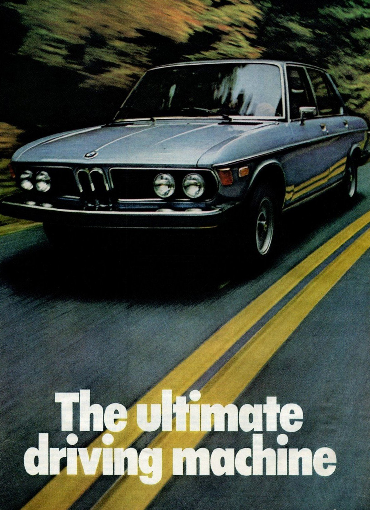

## Do you need a tagline or a slogan? If you're asking, the answer is probably *both*, but let's clear up the copywriting jargon while we're at it.

If you're looking for a writer to help create fresh copy for your website or a particular marketing campaign, you might be trying to meet them halfway, so to speak, by speaking their jargon. By clarifying what you need in terms a copywriter immediately understands, you can cut confusion at the beginning of a project and eliminate the threat of (often expensive) rework. The difference between a tagline and a slogan is one of the most misrepresented and misunderstood, even among marketers.

Time to set the record straight.

We move ahead with these definitions keeping in mind a few caveats: Many writing and marketing terms are roughly interchangeable and depend on the writer in question, the business they're working for, and even the country itself. Not even Americans and Britons can agree on much when it comes to "proper" English.

## A tagline distills your entire brand into a short, catchy, memorable, and long-lasting phase.

And that's no simple task, especially when most taglines land somewhere between 5-10 words.

A good tagline is more than a witty phrase, although that's important, too. It also needs to identify core company values, key differentiators, and value propositions—everything that makes your brand worthy of someone's time or money. The best taglines not only establish the brand's benefits but also attract the *right* type of customer.

One of the great taglines is BMW's "The Ultimate Driving Machine," which they [first released in 1974](http://www.bmwstyle.tv/the-ultimate-driving-campaign/) throughout their North American branding. It's short, witty, explains why BMW is different, and perhaps most importantly, makes those who covet or own a BMW feels as though they're part of an exclusive community of people. It makes them think to themselves, "Yes, I'm the kind of person who drives The Ultimate Driving Machine."

As with a company's name or logo, taglines are a core branding asset that shouldn't change often. Developing a new tagline should be treated with the same seriousness as changing these other aspects of your brand. But, once you settle on a tagline you like, you can use it freely on all your marketing assets—let the time, effort, and money put into a tagline work for your brand again and again.

##  A slogan is for the battle you're fighting right now.

That's because the word "slogan" is derived from the Scottish Gaelic/Irish *sluagh-ghairm*, which roughly translates to "battle cry." Your tagline serves as the foundation for your brand's identity, but what if you need another short, witty piece of copy to help identify only a certain product or marketing campaign? That's the work of a slogan: a "battle cry" for the product you're trying to sell right now.

Longevity and focus are the main differences between a tagline and a slogan. Slogans are meant to be temporary, identifying only a brand's most pertinent campaign. They change often and thus are always representative of the newest product or marketing push. They have a narrow focus and don't attempt to explain the entire brand's differentiators and value props.

Let's look at another BMW campaign for a real-world example. In 2013, the company launched a new advertising campaign for its 4-Series Coupe concept using the new slogan "Sheer Driving Pleasure."

You can see the slogan used twice in the ad above. A keen eye might notice that "Sheer Driving Pleasure" has also replaced the "Ultimate Driving Machine" tagline, which usually sits beneath the BMW logo, for this campaign. The clever "Fasterpiece," a play on "masterpiece," operates as a secondary slogan for this particular advertisement.

## The point is you need some catchy copy for your brand.

Let's try our hand at some distillation. Taglines vs. slogans in as few points as possible:

  * Taglines distill an entire brand into a single, short phrase.
  * Taglines are meant to be semi-permanent, changing only during significant rebranding efforts, which would also include a new logo, a new website, and so on.
  * Slogans are short-lived and used only for a single marketing campaign selling.
  * A slogan can be adapted into a tagline if a brand doesn't yet have a tagline, or is looking to replace their existing one.

## Creating good taglines or slogans, much less using them effectively, are another matter entirely.

In future posts, I'll guide you through brainstorming activities that will help you figure out your brand's next tagline and detail proven strategies for deploying taglines and slogans in the most effective way possible. Subscribe to get access to these guides before I publish them for everyone else.



Or, to get a head start on your next tagline or slogan development or deployment strategy, schedule a 20-minute strategy session with me. You'll take away some actionable items you can start working on right now, and we'll figure out if we're a right fit.

