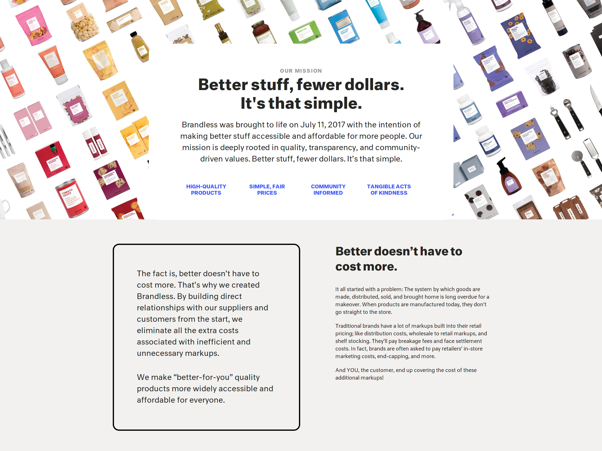

It's the first edition of *Copy Break*—an ongoing series in which I look at a well-known brand's copywriting for the first time and offer my praise and constructive criticism on how they're writing about themselves.

*Copy Break* showcases some of the strategic thinking I would perform before engaging you in a [discovery meeting](https://calendly.com/nurse-media/introductions). The actionable items at the post's end are similar to those I would offer during the call, free of charge, as we're deciding whether we're a good fit and how I could best help.

---

Next up on Copy Break: *Brandless*.

I first heard about [Brandless](https://brandless.com/) via [*The Growth Show*](https://www.hubspot.com/podcasts/the-growth-show), a podcast from HubSpot. The brand's founder, Tina Sharkey, spoke at length about how the company established its brand, morphed it over time to accommodate changes in their goals, and finally settled on the existing copy.

## Let's first take a scroll down Brandless' homepage and make a 5-minute assessment of their copy.

Right off the bat, I'm not too enthusiastic about the full-page popup that prevents me from seeing any of Brandless' more permanent copywriting, but I understand the business need for a holiday promotion.

Closing that, I see Brandless' tagline: *Better Everything. For Everyone.*

I like the first half of this tagline, which reinforces the visitor's understanding that Brandless is dedicated to high-quality products despite them not wearing a high-quality brand badge. The second half falls flat to me for reasons I'll explain later.

Moving down the page, I see one more copy-heavy section.

This section is critical because it delivers three essential points about Brandless' value proposition and mission. Aside from a few misplaced commas, and extra non-breaking space, and some wordiness, this section is powerful. Three headers, four sentences, a lot of clarity about the company.

Brandless dedicates the remainder of their homepage to traditional e-commerce carousels, testimonials, and current promotions.

I hopped over to the [About](https://brandless.com/about) page to find a bit more copy. We see some company history and current mission:

Alongside a more thorough explanation of their pricing strategy:

There's plenty more copy scattered around the site—particularly headers and calls to action to lead visitors into other sections of the site—but this covers the most significant copywriting.

Let's break everything we've seen down into three actionable items:

## 1. Avoid "everyone" in your tagline, unless you're a very well-known known entity.

Saying your brand is for "everyone" is a lie, albeit an unintentional one. No single product, or even range of products, applies to every single possible consumer. Trying to argue as much is a losing battle.

The exception to this rule is a name-brand company with a proven track record of delivering high-quality products at reasonable prices that are generally available and desirable. Consumer packaged goods, food and beverage, or electronics brands are usually the only ones that can pull the "everyone" move off.

Brandless hasn't grown enough to match its "everyone" ambitions. I am not trying to diminish their success—it's an honest assessment of their brand awareness and growth curve.

Targeting the broadest possible spectrum of consumers is also not an ideal growth strategy, as it's hard to write copy that appeals to everyone. The company could examine existing customer data or pursue research more aggressively to determine which cross-section of "everyone" is most profitable. There's a big difference between wealthy consumers who dislike the large food/CPG brands and consumers who are struggling to make ends meet.

I briefly brainstormed over alternative taglines for Brandless, but then realized their mission statement could perform better as a tagline: "Better stuff, fewer dollars." It's just as simple as the current tagline (and Brandless values simplicity), and better conveys the company's primary value proposition, which is less cost for high-quality goods.

Finding strong tagline alternatives further down the homepage, or deeper in the site structure, is common. We tend to write taglines to meet the widest audience possible, and then drill down into specific value propositions or niches elsewhere. But, when copywriting toward the ideal customer, specifics perform better than generalities. Brandless definitely fits this mold, in my opinion.

**TODO: Avoid catering to everyone and focus in on your ideal customer. Look for strong copy that's currently hidden elsewhere on your site and "promote" it if necessary.**

## 2. Even e-commerce can, and should, be copy-heavy.

One of the first things I noticed about the Brandless homepage is that it's devoid of positional statements and any copy that clarifies the company's ideal customer. I think that harms, rather than helps, their mission-driven work.

The About page is cumbersome on copy, however, which creates an imbalance between pages. The sheer volume of copy is overwhelming, and de-prioritizes essential parts of their mission, such as donating meals to Americans facing hunger.

I would recommend expanding on the homepage copy, perhaps creating three entire sections—rather than the three-pointed "Why Live Brandless" section—that cover the same topics. Doing so is as simple as translating some, or all, of the copy from the About page onto the homepage.

**TODO: Spread copy evenly across a site or experience to avoid copy peaks and valleys. Pull copy from the "about us" page onto the homepage to promote the brand's values and mission alongside its products and value proposition.**

## 3. Refocus on "you."

The About page also focuses on Brandless' efforts to create high-quality, low-cost food and CPG products, but fails to turn the conversation back to why someone would care, gain value, and abandon their traditional means of getting groceries in favor of the Brandless method.

The About page contains roughly 1400 words of copy, and features the word "you" only 15 times. This gives me an indication the copy focuses too heavily on the company to the detriment of talking about the value Brandless brings to its customers.

I would suggest rewriting the About page copy to more focus on the customer instead of the company. One exercise to create customer-centric copy is to ensure it answers these three questions from the customer's perspective:

- "What's in it for me?" (Or, "What value does this company offer?")
- "Can I trust this company will deliver on their promises?"
- "Does the pricing make sense given the promises and the trust they've created?"

Answering those three questions is not the only means of creating customer-centric copy, but it is one possible strategy.

A strategy that *will not work* is adding more uses of the word "you." Simple repetition of a word does not create clean copy or intent.

**TODO: Rewrite sections of copy to refocus on "you." Be clear about the value Brandless offers to customers instead of talking about the company's ideas and innovations.**

---

And that's the first edition of Copy Break! I hope this has been helpful—to see following editions as soon as I publish them, be sure to subscribe.


