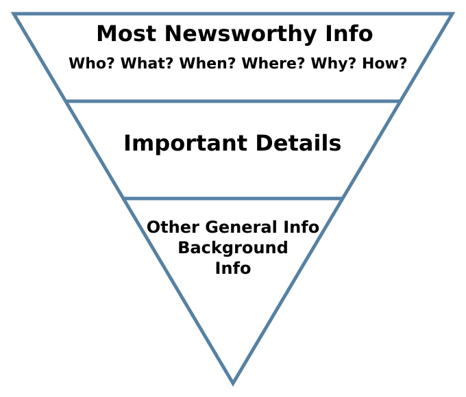
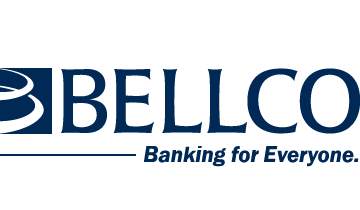
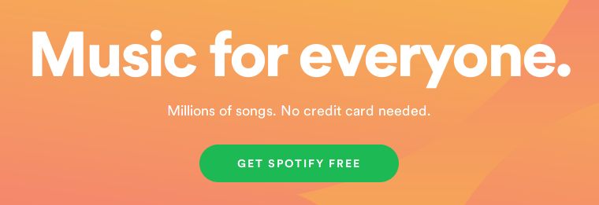

Your copywriting needs to do an incredible amount of work. It needs to engage visitors and inspire them to do something that helps you and (hopefully) offers them some value. And it needs to do that in a matter of seconds.

Whether you've been writing for decades or an indie hacker who's trying bootstrap a landing page as soon as possible, the process of writing impactful copy doesn't really get much easier. There are no shortcuts.

You need a reliable, repeatable process for making your copy foolproof. Enter the *copywriting checklist*.

But this checklist is going to do things a little differently. All the other copywriting checklists ask vague questions you probably don't even understand in the first place.

> Sorry, *Copyblogger*, but what does "Is one dominant emotion (i.e., “mass desire”) powerfully verbalized?" mean?

In this checklist I'm dead-set on practical steps you can take to improve your copy. No fluffy questions. Just practical tips that you can apply to any piece of copywriting even without a lot of experience. We're going to start with some of the bigger-order items and then progress toward the more nuanced word choice and grammatical improvements.

## 1. Ask the copy "why" 5 times

The Japanese carmaker Toyota [changed the way manufacturing companies work](https://en.wikipedia.org/wiki/5_Whys). Part of that revolution comes straight out of a curious toddler's playbook: asking "why" until it's equal parts annoying and incredibly insightful.

Here's an example. Let's say you have a SaaS business called *Proofish* that helps other businesses use [social proof](https://neilpatel.com/blog/social-proof/) on their websites. You just spent time copywriting your new homepage and came up with the following tagline:

*Proofish* creates social proof for your website.

Ask that copy "why." Rewrite the tagline to answer it.

*Proofish* creates social proof for your website so more visitors turn into customers.

Try again.

*Proofish* creates social proof for your website and increases trust so more visitors turn into customers and your revenue grows.

Why?

*Proofish* creates social proof for your website and increases trust with automated tools so more visitors turn into customers and your revenue grows—without any extra work on your part.

Go deeper.

*Proofish* is social proof automation to boost traffic, trust, and conversions without any extra work on your part.

One more.

*Proofish* automates social proof to effortlessly boost trust, traffic, and conversions.

Now we're talking.

There are two important items to note in this process.

  1. **It gets messier before it gets cleaner.** You'll notice that the first few iterations tend to get longer and less concise because you're adding in features to answer the "why" question. Just remember that by the third or fourth iteration you should be turning toward *the value this product creates* rather than continuing to talk about features.
  2. **You need to know the end before you get there.** The final version should talk directly to how the product/service solves a difficult problem and creates value. In the above example, we're assuming that you've done your customer research and have discovered that trust, traffic, and conversions are the most important metrics for your target customer. If your final "why" misaligns with their needs, you won't have accomplished anything here.

  

    
Ask the copy "why" 5 times:

    

      <input type="checkbox" id="1-1" name="1-1">
      <label for="1-1">I asked the copy "why" five times.</label>
    

  

## x. Use the inverted pyramid

When writing new stories, journalists pratice what's called the *inverted pyramid*. 

The goal is to convey as much essential information as quickly as possible. What happened? Where did the event happen? When? Who was involved? Why did it happen? How did it happen? Once the journalist has answered these essential questions, they can start including more contextual information and quotes from sources or observers.

Your copy should do the same. 

Answering all [Five Ws](https://en.wikipedia.org/wiki/Five_Ws) in a single sentence—for example, a tagline that shows up on your website's homepage—is 

  

    
Use the inverted pyramid:

    

      <input type="checkbox" id="2-1" name="2-1">
      <label for="2-1">I put the most important information first.</label>
    

    

      <input type="checkbox" id="2-2" name="2-2">
      <label for="2-2">I answered all Five Ws.</label>
    

  

## x. Look for an overabundance of "we" or "us"

A lot of copy in the tech/SaaS space focuses too heavily on the product that's been created or its specific features. It turns attention to the company—or even individuals within the company—instead of focusing on the customer.

I call this **we-centric copy**.

Take a look at this theoretical example of homepage text from a web hosting company:

People host their websites with Hostio.io because we built the fastest, most resilient cloud possible with top-of-the-line hardware and super-fast networking partners. We even built our own custom dashboard with 50+ one-click installers. We even have awesome engineers available 24/7 for when something goes wrong.

That's an exaggeration on a number of levels, but you get the point: The copy talks far too much about the company and not nearly enough about the customer. Because customers don't care about "50+ one-click installers" if they don't know what that means for them.

A shortcut to fixing this issue is restructuring each sentence containing "we" to focus on the customer and instead use "you." Here's a rough translation:

Host your website on top-of-the-line hardware and super-fast networking partners to get the fastest, most resilient cloud possible. You can deploy blogs or apps in a single click with 50+ installers. If you have questions or issues, awesome engineers are available 24/7.

That copy is *far* from perfect, but refocusing on "you" helps show visitors the value they would get from Hostio.io's solution instead of bragging about the company's hard work. It's more clear that they get a fast/reliable service, can deploy a site without knowing a ton of code, and can reach out to support if need be.

Now that you've reduced your reliance on "we" and are focused on the visitor, you need to then showcase your *value*.

## x. Eliminate generalist language

It's tempting to write copy that tries to connect to as many people as possible. A business wants the most customers possible. Right?

Right. But trying to sell to the widest net isn't going to work.

You've probably seen examples of companies that try to sell to "everyone." Take [Bellco](https://www.bellco.org/), a real credit union-style bank in Denver, Colorado.

Their tagline is "Banking for Everyone," and it's *absolutely untrue*. I live in Arizona, and while our states [kind of touch each other](https://en.wikipedia.org/wiki/Four_Corners), I'm not going to drive 12 hours to visit one of Bellco's branches when I need some one-on-one help with my banking. And it doesn't make clear what kind of person they serve. Are they focused on individuals or businesses? Could they help me get a mortgage? What do they do differently?

The truth is that **generalist language like "everyone" actually creates complexity for a visitor**. It doesn't help anyone feel welcomed. All it does is create confusion.

Before you begin copywriting, you should have done your homework about who the target audience is, what they care about, and what words they use to talk about the problem they're having.

Of course, there's always an exception to prove the rule:

Most everyone doesn't have the clout to pull it off. But Spotify does.

Good for them.

  

    
Eliminate generalist language:

    

      <input type="checkbox" id="4-1" name="4-1">
      <label for="4-1">I eliminated "everyone" from my copy.</label>
    

    

      <input type="checkbox" id="4-2" name="4-2">
      <label for="4-2">I removed other generalist language in favor of verbiage that targets my ideal audience.</label>
    

  

## Remove unnecessary jargon but speak to what the audience cares about

## The rest

- Make the copy scannable
    - Use short(ish) paragraphs 
    - Keep your paragraphs relatively short and focused on one idea
    - Vary the lengths of your sentences to create a changing rhythm
    - Use white space to put some breathing room around your copy

- Know your keywords and distribute them evenly
    - Don't go overboard
    - Make sure the copy doesn't forget about the important keywords by the end
    - This also helps remind visitors of their goals and your solution

- Run your work through an online grammar checker
    - Grammarly is my favorite
    - A free alternative: http://www.hemingwayapp.com/

- Check for lack of conciseness
    - Remove phrases like "really" or "actually,"
    - "period of time" can be "period"

- Read it out loud
    - Does it sound weird? Then it reads weird too
    - Does it sound like a human?

https://www.bruceclay.com/blog/seo-copywriting-checklist/
https://www.copyblogger.com/optimize-online-copy/
https://copywritematters.com/essential-copywriting-check-list-incredibly-effective-copywriting/
https://www.enchantingmarketing.com/copywriting-essentials-checklist/

  

    
Ask the copy "why" 5 times:

    

      <input type="checkbox" id="1-1_final" name="1-1">
      <label for="1-1_final">I asked the copy "why" five times.</label>
    

    
Use the inverted pyramid:

    

      <input type="checkbox" id="2-1_final" name="2-1">
      <label for="2-1_final">I put the most important information first.</label>
    

    

      <input type="checkbox" id="2-2_final" name="2-2">
      <label for="2-2_final">I answered all Five Ws.</label>
    

    
Eliminate generalist language:

    

      <input type="checkbox" id="4-1_final" name="4-1">
      <label for="4-1_final">I eliminated "everyone" from my copy.</label>
    

    

      <input type="checkbox" id="4-2_final" name="4-2">
      <label for="4-2_final">I removed other generalist language in favor of verbiage that targets my ideal audience.</label>
    

  

