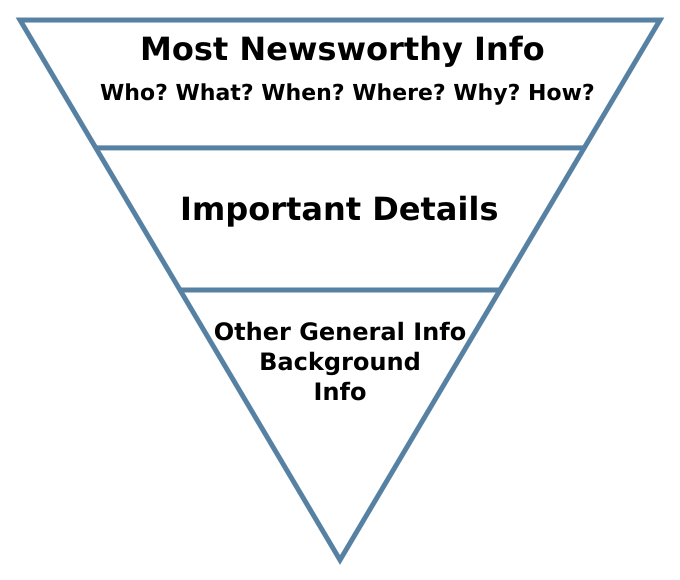
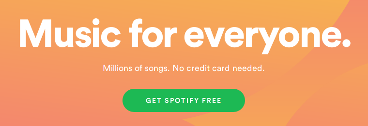

Your copywriting needs to do an incredible amount of work. It needs to engage visitors and inspire them to do something that helps you and (hopefully) offers them some value. And it needs to do that in a matter of seconds.

Whether you've been writing for decades or an indie hacker who's trying bootstrap a landing page as soon as possible, the process of writing impactful copy doesn't really get much easier. There are no shortcuts.

You need a reliable, repeatable process for making your copy foolproof. Enter the *copywriting checklist*.

But this checklist is going to do things a little differently. All the other copywriting checklists ask vague questions you probably don't even understand in the first place.

> Sorry, *Copyblogger*, but what does "Is one dominant emotion (i.e., “mass desire”) powerfully verbalized?" mean?

In this checklist I'm dead-set on practical steps you can take to improve your copy. No fluffy questions. Just practical tips that you can apply to any piece of copywriting even without a lot of experience. We're going to start with some of the bigger-order items and then progress toward the more nuanced word choice and grammatical improvements.

  

    
Be sure to check items off the checklist as you go! You can find helpful checkboxes in this sidebar and at the end of the post.

  

## 1. Ask the copy "why" 5 times

The Japanese carmaker Toyota [changed the way manufacturing companies work](https://en.wikipedia.org/wiki/5_Whys). Part of that revolution comes straight out of a curious toddler's playbook: asking "why" until it's equal parts annoying and incredibly insightful.

Here's an example. Let's say you have a SaaS business called *Proofish* that helps other businesses use [social proof](https://neilpatel.com/blog/social-proof/) on their websites. You just spent time copywriting your new homepage and came up with the following tagline:

*Proofish* creates social proof for your website.

Ask that copy "why." Rewrite the tagline to answer it.

*Proofish* creates social proof for your website so more visitors turn into customers.

Try again.

*Proofish* creates social proof for your website and increases trust so more visitors turn into customers and your revenue grows.

Why?

*Proofish* creates social proof for your website and increases trust with automated tools so more visitors turn into customers and your revenue grows—without any extra work on your part.

Go deeper.

*Proofish* is social proof automation to boost traffic, trust, and conversions without any extra work on your part.

One more.

*Proofish* automates social proof to effortlessly boost trust, traffic, and conversions.

Now we're talking.

There are two important items to note in this process.

  1. **It gets messier before it gets cleaner.** You'll notice that the first few iterations tend to get longer and less concise because you're adding in features to answer the "why" question. Just remember that by the third or fourth iteration you should be turning toward *the value this product creates* rather than continuing to talk about features.
  2. **You need to know the end before you get there.** The final version should talk directly to how the product/service solves a difficult problem and creates value. In the above example, we're assuming that you've done your customer research and have discovered that trust, traffic, and conversions are the most important metrics for your target customer. If your final "why" misaligns with their needs, you won't have accomplished anything here.

  

    
Ask the copy "why" 5 times:

    

      <input type="checkbox" id="1-1" name="1-1">
      <label for="1-1">I asked the copy "why" five times.</label>
    

  

## 2. Use the inverted pyramid

When writing news stories, journalists pratice what's called the *inverted pyramid*. 

The goal is to convey as much essential information about the event as quickly as possible. What happened? Where did it happen? When? Who was involved? Why did it happen? How did it happen? 

Once the journalist has answered these essential questions, they can start to include contextual information or quotes from sources/witnessses.

Your copy should follow the same formula: Answer the [Five Ws](https://en.wikipedia.org/wiki/Five_Ws) as quickly as possible. The less scrolling, the better.

But be realistic about how much information you can fit into a single sentence. Your tagline might only be able to answer *what* and *why*. The copy that immediately follows should take care of the rest.

  

    
Use the inverted pyramid:

    

      <input type="checkbox" id="2-1" name="2-1">
      <label for="2-1">I put the most important information first.</label>
    

    

      <input type="checkbox" id="2-2" name="2-2">
      <label for="2-2">I answered all Five Ws.</label>
    

  

## 3. Look for an overabundance of "we" or "us"

A lot of copy in the tech/SaaS space focuses too heavily on the product that's been created or its specific features. It turns attention to the company—or even individuals within the company—instead of focusing on the customer.

I call this **we-centric copy**.

Take a look at this theoretical example of homepage text from a web hosting company:

People host their websites with Hostio.io because we built the fastest, most resilient cloud possible with top-of-the-line hardware and super-fast networking partners. We even built our own custom dashboard with 50+ one-click installers. We even have awesome engineers available 24/7 for when something goes wrong.

That's an exaggeration on a number of levels, but you get the point: The copy talks far too much about the company and not nearly enough about the customer. Because customers don't care about "50+ one-click installers" if they don't immediately understand the value they'd get from it.

The way I recommend fixing this issue is to take a look at any sentence containing "we" or "us." Is there a way to use "you" and focus on the customer instead?

Here's a rough translation using this principle:

Host your website on top-of-the-line hardware and super-fast networking partners to get the fastest, most resilient cloud possible. You can deploy blogs or apps in a single click with 50+ installers. If you have questions or issues, awesome engineers are available 24/7.

That copy is *far* from perfect, but refocusing on "you" helps show visitors the value they would get from Hostio.io's solution instead of bragging about the company's hard work. It's more clear that they get a fast/reliable service, can deploy a site without knowing a ton of code, and can reach out to support if need be.

  

    
Look for an overabundance of "we" or "us":

    

      <input type="checkbox" id="3-1" name="3-1">
      <label for="3-1">I refactored the copy to focus on "you" instead of "we".</label>
    

  

## 4. Eliminate generalist language

It's tempting to write copy that tries to connect to as many people as possible. A business wants the most customers possible. Right?

Right. But trying to sell to the widest net isn't going to work.

You've probably seen examples of companies that try to sell to "everyone." Take [Bellco](https://www.bellco.org/), a real credit union-style bank in Denver, Colorado.

Their tagline is "Banking for Everyone," and it's *absolutely untrue*. I live in Arizona, and while our states [kind of touch each other](https://en.wikipedia.org/wiki/Four_Corners), I'm not going to drive 12 hours to visit one of Bellco's branches when I need some one-on-one help with my banking. And it doesn't make clear what kind of person they serve. Are they focused on individuals or businesses? Could they help me get a mortgage? What do they do differently?

The truth is that **generalist language like "everyone" actually creates complexity for a visitor**. It doesn't help anyone feel welcomed. All it does is create confusion.

Before you begin copywriting, you should have done your homework about who the target audience is, what they care about, and what words they use to talk about the problem they're having.

Of course, there's always an exception to prove the rule:

Most everyone doesn't have the clout to pull it off. But Spotify does.

Good for them.

  

    
Eliminate generalist language:

    

      <input type="checkbox" id="4-1" name="4-1">
      <label for="4-1">I eliminated "everyone" from my copy.</label>
    

    

      <input type="checkbox" id="4-2" name="4-2">
      <label for="4-2">I removed other generalist language in favor of verbiage that targets my ideal audience.</label>
    

  

## 5. Remove unnecessary jargon

Tech businesses love to talk about what's under the hood. It makes sense—they have pride in the product/solution/platform they've built.

But too much jargon will dramatically narrow the pool of visitors who will keep reading or stick around long enough to convert. If they feel out of their league or don't understand the product's value, they won't stick around.

Let's pick on a blockchain startup, because that's easy. Here's the first piece of copy on the [Auditchain](https://auditchain.com) homepage:

Decentralized Continuous Audit & Reporting Protocol Ecosystem™

And the first piece of body copy:

The reporting and disclosure framework for twenty first century business has arrived! Auditchain is the world's first decentralized continuous audit and real time reporting ecosystem for enterprise and token statistics disclosure. The science of continuous audit has been limited to enterprise internal audit and reporting up until now.

Jargon isn't just confusing. It doesn't just significantly narrow your field of interestd, understanding readers. It also masks the true value of the product or service.

That said, your copy should reflect the words, ideas, and methodologies used by your target audience. You want to assure them you speak the same language. But instead of using technical jargon to get there, talk about the business problems they're having and the business solutions you're about to solve.

  

    
Remove unnecessary jargon:

    

      <input type="checkbox" id="5-1" name="5-1">
      <label for="5-1">I eliminated technical, audience-reducing jargon from my copy.</label>
    

    

      <input type="checkbox" id="5-2" name="5-2">
      <label for="5-2">I ensured that I'm speaking the same language as my target audience by talking about their problems in ways they immediately understand.</label>
    

  

## 6. Know your keywords, distribute them evenly

I'm not a big fan of prioritizing SEO optimization over readability. It doesn't matter if Google loves your copy if your customers don't understand it. But the reality is that every website needs organic search traffic.

If you don't know your keywords, you should pause your copywriting and hop into [Google Analytics](https://analytics.google.com/analytics/web/), [Google Search Console](https://search.google.com/search-console/about), [Moz](https://moz.com/), [Ahrefs](https://ahrefs.com/), [Ubersuggest](https://neilpatel.com/ubersuggest/), or any other SEO tool of your choice and explore your keywords. You should be looking for keywords that your website might already rank for, what drives organic search traffic to visit your site, and phrases you'd *like* to do better with.

Reframe and rebuilt your copy to target these keywords, but be careful and don't go overboard by jamming in too many keywords. Your first priority is value- and customer-focused copy that's easy to understand.

And, depending on the length of copy you're working with, make sure you're dropping individual keywords and regular intervals. If there's eight paragraphs of text, you might want your keyword to naturally appear in paragraphs #1, #3, #6, and #8. If you're working on just a few short lines, your ability to distribute keywords multiple times will be limited.

By selecting your keywords and inserting them regularly, you 1) reinforce to Google that these terms are important to your business, and 2) reinforce with visitors their problems, their goals, and the value of your solution.

  

    
Know your keywords, distribute them evenly:

    

      <input type="checkbox" id="key-1" name="key-1">
      <label for="key-1">I researched the most important and valuable keywords to my business based on past success and future goals.</label>
    

    

      <input type="checkbox" id="key-2" name="key-2">
      <label for="key-2">I inserted keywords into my copy in a natural way that does not detract from readability.</label>
    

    

      <input type="checkbox" id="key-3" name="key-3">
      <label for="key-3">I distributed keywords evenly across my copy when applicable.</label>
    

  

## Make your copy scannable

As tempting as long paragraphs of flowery, long, and prosaic sentences might be, they're not ideal for conversion copywriting.

As someone who loves a good long sentence, this hurts. But a visitor's attention span is short and always looking for an excuse to hit the `Back` button.

You want copy that's easy enough to read that someone could scan it and still get the gist. There are a few ways to help make that happen:

**Use short(ish) paragraphs.** I aim for paragraphs of 2-3 sentences most of the time. Sometimes, a single-sentence paragraph can be a punchy attention-grabber, especially if the sentence is short too.

**Keep paragraphs focused on one idea.** Remember topic sentences? They're relevant again. Focus your paragraphs on a single value/feature/benefit so visitors don't miss something important if they're scanning.

**Vary your sentence length to create a dynamic rhythm.**

**Use white space to make copy stand out.**

## The rest

- Run your work through an online grammar checker
    - Grammarly is my favorite
    - A free alternative: http://www.hemingwayapp.com/

- Check for lack of conciseness
    - Remove phrases like "really" or "actually,"
    - "period of time" can be "period"

- Read it out loud
    - Does it sound weird? Then it reads weird too
    - Does it sound like a human?

https://www.bruceclay.com/blog/seo-copywriting-checklist/
https://www.copyblogger.com/optimize-online-copy/
https://copywritematters.com/essential-copywriting-check-list-incredibly-effective-copywriting/
https://www.enchantingmarketing.com/copywriting-essentials-checklist/

  

    
Ask the copy "why" 5 times:

    

      <input type="checkbox" id="1-1_final" name="1-1">
      <label for="1-1_final">I asked the copy "why" five times.</label>
    

    
Use the inverted pyramid:

    

      <input type="checkbox" id="2-1_final" name="2-1">
      <label for="2-1_final">I put the most important information first.</label>
    

    

      <input type="checkbox" id="2-2_final" name="2-2">
      <label for="2-2_final">I answered all Five Ws.</label>
    

    
Look for an overabundance of "we" or "us":

    

      <input type="checkbox" id="3-1" name="3-1">
      <label for="3-1">I refactored the copy to focus on "you" instead of "we".</label>
    

    
Eliminate generalist language:

    

      <input type="checkbox" id="4-1_final" name="4-1">
      <label for="4-1_final">I eliminated "everyone" from my copy.</label>
    

    

      <input type="checkbox" id="4-2_final" name="4-2">
      <label for="4-2_final">I removed other generalist language in favor of verbiage that targets my ideal audience.</label>
    

    
Remove unnecessary jargon:

    

      <input type="checkbox" id="5-1_final" name="5-1">
      <label for="5-1_final">I eliminated technical, audience-reducing jargon from my copy.</label>
    

    

      <input type="checkbox" id="5-2_final" name="5-2">
      <label for="5-2_final">I ensured that I'm speaking the same language as my target audience by talking about their problems in ways they immediately understand.</label>
    

    
Know your keywords, distribute them evenly:

    

      <input type="checkbox" id="key-1_final" name="key-1">
      <label for="key-1_final">I researched the most important and valuable keywords to my business based on past success and future goals.</label>
    

    

      <input type="checkbox" id="key-2_final" name="key-2">
      <label for="key-2_final">I inserted keywords into my copy in a natural way that does not detract from readability.</label>
    

    

      <input type="checkbox" id="key-3_final" name="key-3">
      <label for="key-3_final">I distributed keywords evenly across my copy when applicable.</label>
    

  

