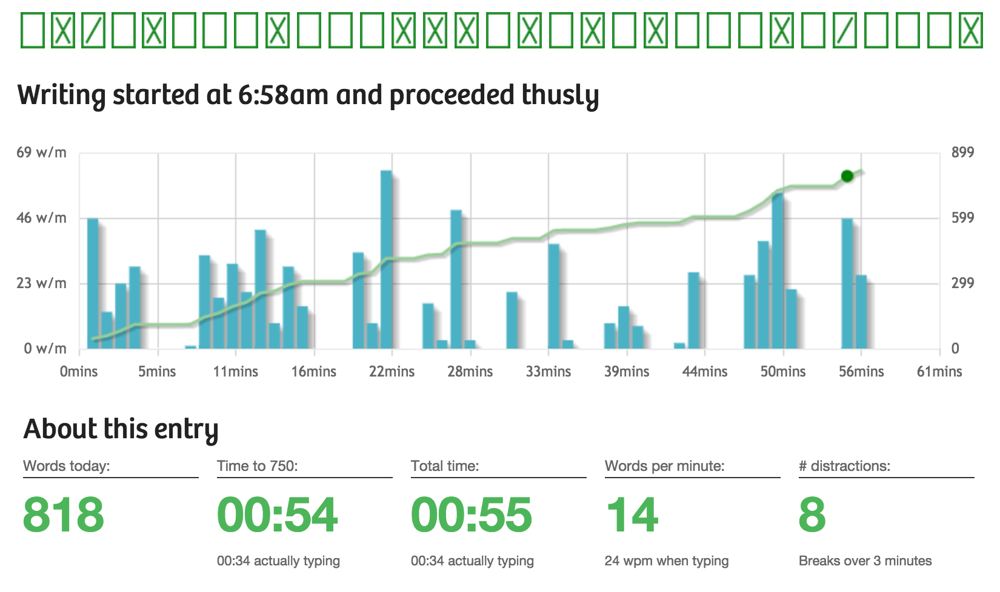

I strongly believe that everyone should have a daily writing habit.

And I mean everyone. That includes you.

The good news is that since you're here, you already have an interest in building that daily writing habit.

Now for the hard part: Sitting down, on a regular basis, and putting words on the page.

The inability to create fundamental writing habits is the No. 1 reason businesses, startup founders, or anyone trying to create online content around their area of expertise fail to follow though.

It's not skill. It's not some dose of magic. 

It's motivation, followed by productivity.

There's three pathways to daily writing motivation: habits, exercises, and tools. Let's talk about the daily writing habit first.

## Our holy grail: the daily writing habit

First, a definition: Your writing becomes a habit when you do it every day, regardless of how you write, how much you write, what you're writing, or what your goals are. It's taking time every day to chain some sentences together. That's it. 

There are no other rules. Writing longhand in a journal every morning is just as valid as writing a post for your startup's blog right in the Wordpress WYSIWYG editor.

**You get to define the bounds of your own daily writing habit.** 👏

Mine?

I tend to write in the morning, sometime between 5 and 7am, before helping get my daughter ready for day care.

Sometimes, when it's winter and still dark, I light a candle.

I often listen to music. Lately it's been a lot of [Better Oblivion Community Center](https://www.betteroblivioncommunitycenter.org/).

I write on my laptop, using VSCode as my editor. I use Markdown for formatting and the [Space Mono font](https://fonts.google.com/specimen/Space+Mono?query=space+mono) because monospace fonts make my eyes happy.

None of these choices make what I do a daily writing habit.

For me, it's the amount of time I spend. I aim for an hour of creative, non-work writing every day. When I hit that hour, I've maintained my habit.

All that hard work has paid off. I've published a [handful of stories](https://joelhans.com/stories) in some reputable magazines. Of course, publication doesn't make a habit either. I'm just trying to get better at promoting my wins.

## Figuring out your bounds

It bears repeating: **You get to define the bounds of your own daily writing habit.**

Your habit doesn't have to be similar to mine or anyone else's. Don't define your success by another person's standards.

Here are are a few ways you can define your habit:

### A word count goal

This is where I recommend people begin. Counting words written is trivial in almost every text editor. I would recommend starting with a few hundred words. 300 words is roughly 1 page. 500 is ambitious for a new writer but certainly feasible. I used to aim for 1,000 words a day.

*Pros*:

- A word count forces you to do more than sit around and *think* about writing.
- Good training if you're thinking about taking on NaNoWriMo. That's 1,667 words a day!

*Cons*:

- The time spent achieving this goal will vary wildly from day to day. Not the most reliable.
- If you make your goal too ambitious, you'll mostly feel disappointed at not achieving it rather than celebrating in your smaller successes.

### A time goal

Instead of focusing on the end production, you can base your habit on time spent. For many, 15 minutes is plenty. As I've said before, I aim for at least an hour a day.

*Pros*:

- Puts your focus on quality, not quantity.
- Also leaves time in your habit for outlining, planning, and other organizational tasks that will make your writing habit stronger.

*Cons*:

- Can be harder to gauge productivity. You might sit at your laptop for an hour but only put in 15 minutes of real writing work.
- You might limit yourself if you set your time goal too low.

### Freeform goals

Some habits tend to work best if they don't restrict themselves by either word count or time. 

*Pros*:

- No limits to your daily habit.
- Higher flexibility—if you have too much happening on a particular day, you don't need to feel guilty about not hitting a certain word count/time goal.

*Cons*:

- Harder to stay accountable to your habit.
- No hard targets to help push you over 

### Changing things up

A habit can be redefined. If your life becomes busier and you have less time, it's okay to shrink your goals while still maintaining the core practice.

In fact, it's probably best to be flexible with the bounds and goals of your daily writing habit. Life changes, and so should your habit.

### Keeping tabs on your habit

No matter what goals you're aspiring to, I recommend tracking your output in *both time and words* into some permanent record. You can use a plain text file, software like [Notion](https://www.notion.so/) or [Airtable](https://airtable.com/), a [Bullet Journal](https://bulletjournal.com/), or anything else that strikes your fancy.

You'll have a historical record of your growing daily writing habit and will have insight into your successes and whether or not your habit needs to expand or become less ambitious.

## A handful of exercises and tools to bootstrap your habit

**Try the [notebook exercise](https://nurse.media/blog/start-writing/)**: Get a lined notebook and write 3 pages with pen or pencil every day. Focus on writing for yourself, not others.

**["Precrastination"](https://queue.acm.org/detail.cfm?id=3280677)**: If you dread sitting down to write, start your habit by doing something you know will give you a satisfied feeling when you're done. Your brain will thank you.

> When you do something that feels satisfying, your brain releases dopamine (just as it does when you cross an item off a to-do list—because it feels good!). So, when you take a walk midway through your work session, your brain gets a hit of dopamine.

> That dopamine triggers the parts of your brain associated with creativity and gets them working. That's when those magical aha! moments happen, because your brain is sending energy to the areas that help you make connections and see things in new ways.

**[200 Words a Day](https://200wad.com/)**: Looking for a more structured way to write, document your success, and connect with others? 200 Words a Day is a web app and community of roughly 2,700 writers who all aim to write at least 200 words a day. The software tracks successful days, streaks, and cumulative word counts. You can also engage with fellow writers via the comments.

**[750 Words](https://750words.com/)**: Another web app for tracking a daily writing habit—this time 750 words a day. Inspired by a variation of the [notebook exercise](https://nurse.media/blog/start-writing/), 750 Words encourages you to write your "morning pages" and gives you statistics about your progress.

**[Writing Streak](https://writingstreak.io/)**: 